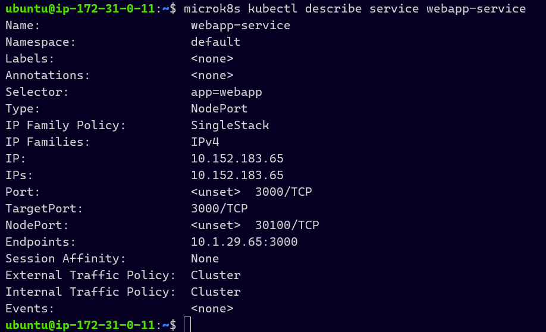
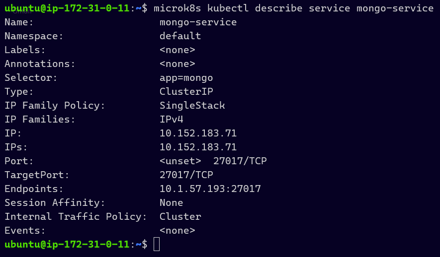

# KN07: Kubernetes II

> **Overview:**
>
> - [A - Terms and Concepts](#a---terms-and-concepts)
> - [B - Demo Project](#b---demo-project)

## A - Terms and Concepts

### Pods vs. Replicas

- **Pods** are the smallest executable Unit in Kubernetes. A Pod contains a single or multiple containers, which run together on a node and share network/IP aswell.

- **Replicas** define, how many instances of a **Pod** should run parallel. They are defined in the `Deployment` (or `StatefulSet`), in order to reach _High Availability (HA)_ and _Load Distribution_.

> **Example:** When you define `replicas: 3`, Kubernetes creates **tree identical Pods** of the defined App.
>
>

### Service vs. Deployment

- A **Deployment** is a Kubernetes-Controller, which is responsibility for the  **Lifecycle-Management of Pods**. Examples of Deployements: Replicas, Rolling Updates, Self-Healing.

- A **Service** is a Networkobject, which allows access to a group of pods, usual over a interne or exeterne DNS and a static IP-Addresse.

> Services allow Clients to reach Pods over a static ip addresse (e.g. _Elastic IP by AWS_).

### Which Problem is solved by Ingress

An **Ingress** is a Kubernetes-Object, which allows HTTP(S)-Routing on Application-Layer _(OSI Layer 7)_

> Without **Ingress**, we would have to create a NodePort or LoadBalancer for each service. Ingress consolidates this under one IP/DNS + path/host-based routing.

### Whats a Statefulset for?

A `StatefulSet` manages _Pods_ with stable identity, persistence and orderd Start/Shutdown.
> [!NOTE]
> Example: StatefulSet is used in Kafka-Cluster, where each Broker requires a personal ID and Storage.

## B - Demo Project

### Difference to A

### MongoUrl

### `microk8s kubectl describe service webapp-service`

### `microk8s kubectl describe service mongo-service`

### Result

To access the Webapp, I had to edit the security group's inbound rules to allow traffic on port 30100.

### MongoDB Compass
