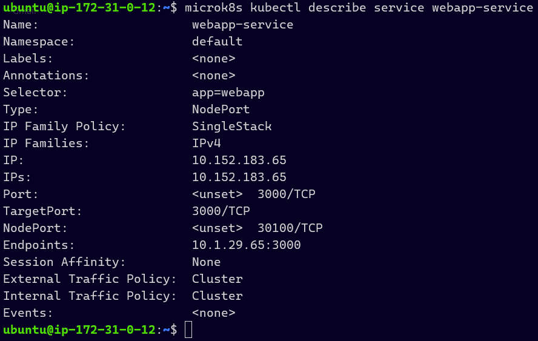
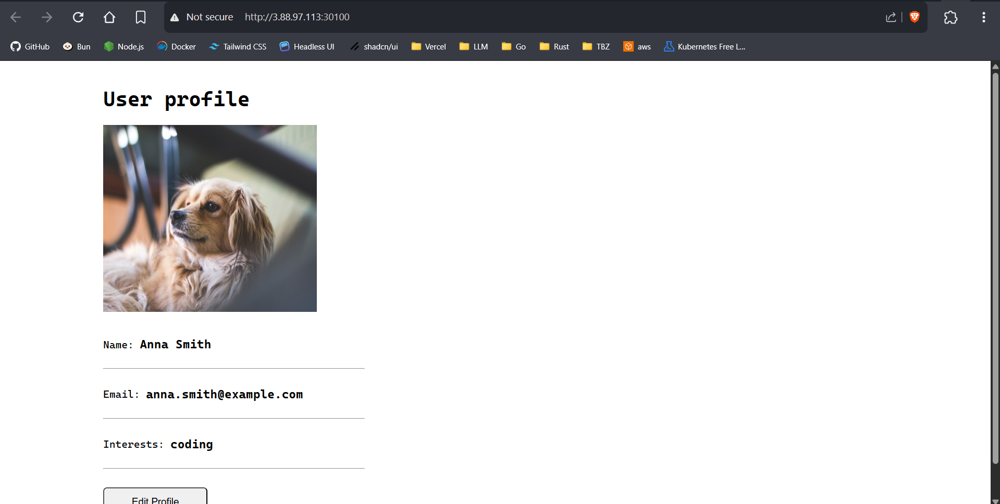
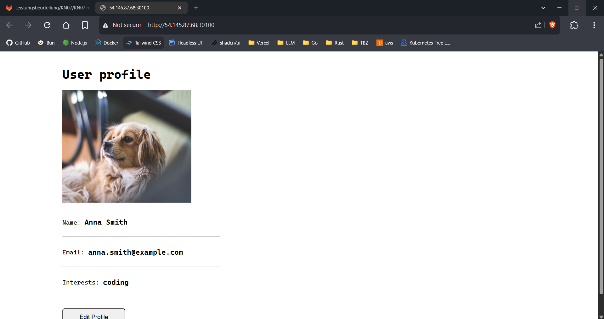
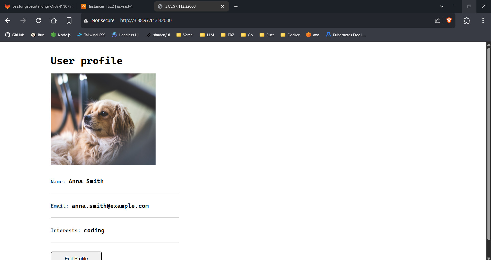
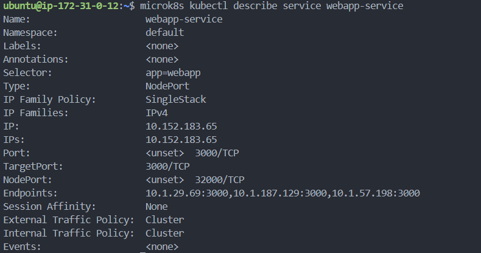

# KN07: Kubernetes II

> **Overview:**
>
> - [A - Terms and Concepts](#a---terms-and-concepts)
> - [B - Demo Project](#b---demo-project)

## A - Terms and Concepts

### Pods vs. Replicas

- **Pods** are the smallest executable Unit in Kubernetes. A Pod contains a single or multiple containers, which run together on a node and share network/IP aswell.

- **Replicas** define, how many instances of a **Pod** should run parallel. They are defined in the `Deployment` (or `StatefulSet`), in order to reach _High Availability (HA)_ and _Load Distribution_.

> **Example:** When you define `replicas: 3`, Kubernetes creates **tree identical Pods** of the defined App.

### Service vs. Deployment

- A **Deployment** is a Kubernetes-Controller, which is responsibility for the  **Lifecycle-Management of Pods**. Examples of Deployements: Replicas, Rolling Updates, Self-Healing.

- A **Service** is a Networkobject, which allows access to a group of pods, usual over a interne or exeterne DNS and a static IP-Addresse.

> Services allow Clients to reach Pods over a static ip addresse (e.g. _Elastic IP by AWS_).

### Which Problem is solved by Ingress

An **Ingress** is a Kubernetes-Object, which allows HTTP(S)-Routing on Application-Layer _(OSI Layer 7)_

> Without **Ingress**, we would have to create a NodePort or LoadBalancer for each service. Ingress consolidates this under one IP/DNS + path/host-based routing.

### Whats a Statefulset for?

A `StatefulSet` manages _Pods_ with stable identity, persistence and orderd Start/Shutdown.
> [!NOTE]
> Example: StatefulSet is used in Kafka-Cluster, where each Broker requires a personal ID and Storage.

## B - Demo Project

### Difference to A

In A is explained, that for production applications with persistent data, like databases, a `StatefulSet` should be used instead of a `Deployment`.

#### Reasoning

- For a simple **demo environment**, a Deployment is sufficient because no high availability or persitent storage is required.
- The focus is on **functionality and demonstration**, not on data integrity or failover.
- Using a StatefulSet requires **additional configuration effort** (e.g., persistent Volume Claims, headless Services), which is unnecessary for a basic demo.

### MongoUrl

The value `mongo-service` is correct, because it is the name of the **Service** that exposes the MongoDB database. The name of the **Service** is used as a DNS name within the Kubernetes cluster to access the MongoDB instance. The same can be done with Containers, so you don't have to set a static IP address.

### `microk8s kubectl describe service webapp-service`




### `microk8s kubectl describe service mongo-service`


### Result

To access the Webapp, I had to edit the security group's inbound rules to allow traffic on port 30100.





### MongoDB Compass

#### Reason

The `mongo-service` is defined as an **internal ClusterIP service**.

```yml
apiVersion: v1
kind: Service
metadata:
  name: mongo-service
spec:
  selector:
    app: mongo
  ports:
    - protocol: TCP
      port: 27017
      targetPort: 27017
```

This means it is only accessible from within the **Kubernetes Cluster** and not exposed externally. There is no **NodePort, LoadBalancer, or Ingress** configured to expose port `27017` to the outside world.

#### Solution

To make it accessible from outside the cluser, the service type has to be changed to `NodePort` or `LoadBalancer`.

```yml
apiVersion: v1
kind: Service
metadata:
  name: mongo-service
spec:
  type: NodePort
  selector:
    app: mongo
  ports:
    - protocol: TCP
      port: 27017
      targetPort: 27017
      nodePort: 32017
```

### Modification steps

1. Modifying `deployment-web.yml`:
	- Replicas (Deployment): `replicas: 1` -> `replicas: 3`
	- NodePort (Service): `nodePort: 30100` -> `nodePort: 32000`
2. Applying the changes in master node:

	```sh
	kubectl apply -f deployment-web.yml
	```

3. Checking the status of the pods:

	```sh
	kubectl describe service webapp-service
	```

#### Screenshots

- Webapp:


- `kubectl describe service webapp-service`:

	The result shows that **3** replicas of the webapp are running. At `Endpoints` you can see that there are now three addresses listed, previously there was only one.

	
